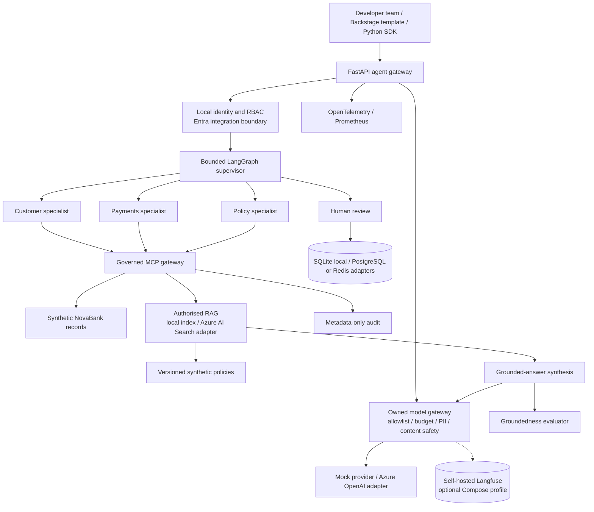

# Architecture diagrams

## Logical platform



Trust boundaries are explicit: public requests terminate at the gateway; agents
cannot access records directly; each MCP invocation validates identity, role,
agent allowlist, schema, rate, timeout and output; high-risk or unknown work ends
at human review. Every model-gateway call — routing, RAG answer synthesis, or
direct API use — passes through the same allowlist, budget, PII and
content-safety controls regardless of caller; there is no path that bypasses
the gateway to reach a model provider directly.

## Secure request sequence

```mermaid
sequenceDiagram
    actor User as Authenticated caller
    participant API as Gateway
    participant LG as LangGraph supervisor
    participant Agent as Approved specialist
    participant MCP as Governed MCP boundary
    participant Data as Synthetic data / RAG
    participant Approval as Approval store

    User->>API: Query + identity + request ID
    API->>API: Authenticate, authorise, rate/body/timeout controls
    API->>LG: Bounded workflow invocation
    LG->>LG: Classify to allowlisted route
    alt Read-only approved capability
        LG->>Agent: Query + caller context
        Agent->>MCP: Typed tool request
        MCP->>MCP: Agent/RBAC/schema/rate/timeout checks
        MCP->>Data: Read-only lookup
        Data-->>MCP: Typed result
        MCP-->>Agent: Validated output + metadata audit
        Agent-->>User: Evidence with source IDs
    else Consequential, unknown, mismatched or failed
        LG->>Approval: Store pending record with query SHA-256 only
        LG-->>User: Human review required; no action executed
    end
```

## Delivery and security gates

```mermaid
flowchart LR
    Change[Local change / pull request] --> Quality[Format + lint + typing + tests]
    Quality --> AI[AI evaluation\nrouting / grounding / safety / security]
    AI --> Ground[Groundedness evaluator quality gate]
    Ground --> AppSec[Secrets + SAST + dependency + licence gates]
    AppSec --> Build[Hardened multi-stage image build]
    Build --> Supply[SBOM + HIGH/CRITICAL scan + offline signature]
    Supply --> Kind[Ephemeral kind + Helm security assertions]
    Kind --> Evidence[Local security reports]
    Plan[Terraform fmt/validate/plan contract] --> Evidence
    Evidence -. workflow_dispatch + typed confirm .-> Publish[Container publish: SBOM, scan, keyless sign, ACR push]
    Evidence -. workflow_dispatch + typed confirm .-> TfPlan[Terraform connected plan]
    TfPlan -. protected environment approval .-> TfApply[Terraform apply]
    Publish -. protected environment approval .-> Deploy[Helm deploy to AKS, digest-pinned]
```



`ci.yaml` (the always-on path, left of the dotted edges) never logs into
Azure, applies Terraform, pushes to a registry, or deploys — that has not
changed. The dotted edges are four separate, `workflow_dispatch`-only
workflows (ADR-013) that exist as code and pass `actionlint`, but cannot yet
authenticate: they need a one-time Azure identity federation step
(`docs/ci-cd-azure-setup.md`) that has deliberately not been run.

## Azure target mapping, not deployment evidence

| Local interface | Azure implementation | Status |
| --- | --- | --- |
| Local headers and RBAC | Microsoft Entra ID and APIM policies | Future |
| Docker and kind/Helm | ACR and private AKS | `deploy.yaml` implemented; blocked on AKS compute quota |
| Local deterministic model | Azure OpenAI (keyless, `DefaultAzureCredential`) | Adapter implemented, unverified against a live endpoint |
| Content moderation | Azure AI Content Safety (keyless) | Adapter implemented, unverified against a live endpoint |
| Local RAG index | Azure AI Search, server-side entitlement-filtered hybrid retrieval | Adapter implemented, unverified against a live index |
| PostgreSQL/Redis adapters | Managed PostgreSQL and Azure Managed Redis | Future |
| OpenTelemetry/Prometheus | Azure Monitor/Application Insights plus managed metrics | Future |
| Local signature exercise | Workload-identity keyless signing and provenance | `container-publish.yaml` implements cosign keyless signing; not yet run live |
