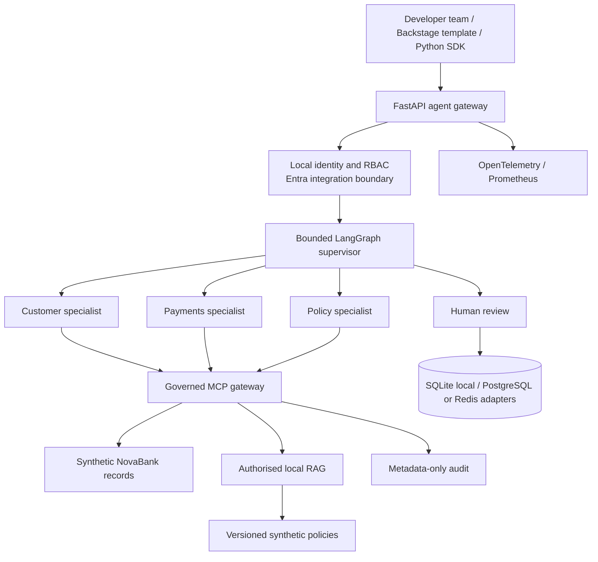
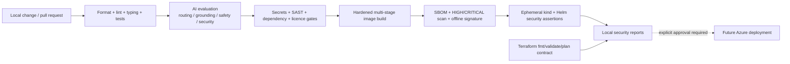

# Architecture diagrams

## Logical platform



Trust boundaries are explicit: public requests terminate at the gateway; agents
cannot access records directly; each MCP invocation validates identity, role,
agent allowlist, schema, rate, timeout and output; high-risk or unknown work ends
at human review.

## Secure request sequence

```mermaid
sequenceDiagram
    actor User as Authenticated caller
    participant API as Gateway
    participant LG as LangGraph supervisor
    participant Agent as Approved specialist
    participant MCP as Governed MCP boundary
    participant Data as Synthetic data / RAG
    participant Approval as Approval store

    User->>API: Query + identity + request ID
    API->>API: Authenticate, authorise, rate/body/timeout controls
    API->>LG: Bounded workflow invocation
    LG->>LG: Classify to allowlisted route
    alt Read-only approved capability
        LG->>Agent: Query + caller context
        Agent->>MCP: Typed tool request
        MCP->>MCP: Agent/RBAC/schema/rate/timeout checks
        MCP->>Data: Read-only lookup
        Data-->>MCP: Typed result
        MCP-->>Agent: Validated output + metadata audit
        Agent-->>User: Evidence with source IDs
    else Consequential, unknown, mismatched or failed
        LG->>Approval: Store pending record with query SHA-256 only
        LG-->>User: Human review required; no action executed
    end
```

## Delivery and security gates



The dotted final edge is deliberately inactive. CI contains no cloud login,
Terraform apply, registry push or deployment step.

## Azure target mapping, not deployment evidence

| Local interface | Future managed implementation |
| --- | --- |
| Local headers and RBAC | Microsoft Entra ID and APIM policies |
| Docker and kind/Helm | ACR and private AKS |
| Local deterministic model | Azure OpenAI / Microsoft Foundry |
| Local RAG index | Azure AI Search |
| PostgreSQL/Redis adapters | Managed PostgreSQL and Azure Managed Redis |
| OpenTelemetry/Prometheus | Azure Monitor/Application Insights plus managed metrics |
| Local signature exercise | Workload-identity keyless signing and provenance |
